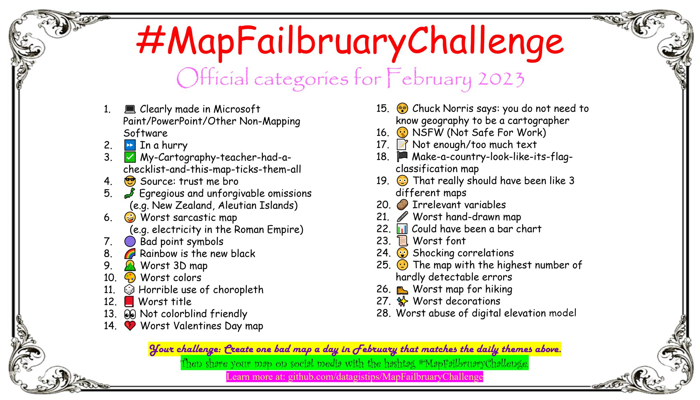

# MapFailbruaryChallenge 🗺️🤢🏆🌟
The official repository for #MapFailbruaryChallenge, a daily mapping challenge open to everyone who will FAIL in creating good maps.

The idea is to create the worst map possible.

One day, one category across February. Here are the categories :

Thanks [Kate (@pokateo_)](https://twitter.com/pokateo_) for this wonderful poster ✨

🏛 Board of undirectors (3) : 
- [Kate (@pokateo_)](https://twitter.com/pokateo_)
- [Jérémy (@mapperfr)](https://mapstodon.space/@jeremy)
- [Mathieu (@datagistips)](https://twitter.com/datagistips)

📣 To communicate on social media, choose #MapFailbruaryChallenge

## 🗓 February
It will be in February considering #30DayMapChallenge takes place in November and #MapFailbruaryChallenge is the opposite.

- February is 2️⃣ months after, November is 2️⃣ months before
- November = 1️⃣1️⃣, 1️⃣ + 1️⃣ = 2️⃣ and 0️⃣2️⃣ is February

Also, February may be the worst month to make a challenge because people concentrate their creative energy on a Valentine's Day gift 💔

## 📄 Outputs
1. [Find the list as a Open Data + Self Data respectful + High Quality CSV file here](https://github.com/datagistips/MapFailbruaryChallenge/blob/main/data/01_Ideas/Ideas-List.csv)
2. [Twitter poll for the hashtag selection](https://twitter.com/datagistips/status/1574530858429841408)
2. [Google Script to populate Google Forms](google-script/auto-populate-google-forms.gs)
3. [Google Forms to vote for the best categories amongst 100 proposals](https://forms.gle/dVAGmcQt3Fcz5pGb8  )
4. [Poll results as a CSV](data/02_Poll/)
5. [Python notebook to analyze the results and select the 28 categories](notebooks)

## 🤹‍♀️ Team worskpace
[Here, you'll find the team workspace](pages/For-the-team.md)

## 🐝 Contributors for the categories
[@ocomarri](https://twitter.com/ocomarri/status/1573581243190579200), [@mapperfr](https://mapstodon.space/@jeremy), [@pokateo_](https://twitter.com/pokateo_), [@DevinMLea](https://twitter.com/DevinMLea/status/1574387314532536321), [@TheTomTurkey](https://twitter.com/TheTomTurkey/status/1574396907207950336), [@helenmakesmaps](https://twitter.com/helenmakesmaps/status/1574382373550047234), [@julgaf (Julien Gaffuri)](https://twitter.com/julgaf), [@kannes](https://github.com/kannes), [@ron_halliday](https://twitter.com/ron_halliday), [@geoObserver_](https://twitter.com/geoObserver_/status/1574593079847550976), [@antoine_halin](https://twitter.com/antoine_halin/), [@DOh_Bams](https://twitter.com/DOh_Bams), [@BranchTwigLeaf](https://twitter.com/BranchTwigLeaf), [@gisn8](https://twitter.com/gisn8), [@stevefaeembra](https://twitter.com/stevefaeembra/), [@SArcPyle](https://twitter.com/SArcPyle), [@XenonGT](https://twitter.com/XenonGT)

## 💾 Archives
[Here, you'll find the archives](pages/Archives.md)
